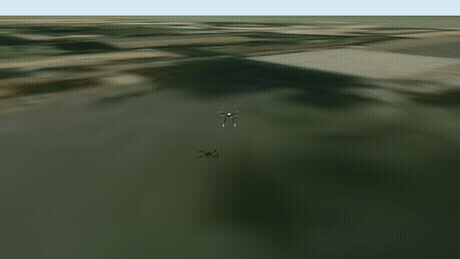
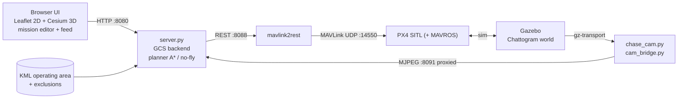

# Maritime Autonomy — Chattogram Port UAV

A full **software-in-the-loop autonomous maritime-patrol simulator**: PX4 SITL +
Gazebo (real Chattogram satellite/terrain world) + ROS 2 autonomy + a browser
Ground Control Station with live map, 3D view, a **no-fly-aware multi-waypoint
mission planner**, and a real-time **chase-camera feed** rendered from the sim.



*Autonomous mission flown in PX4 SITL, rendered in Gazebo over the real Chattogram
port terrain, captured from the in-sim chase camera. ([full video](media/demo.mp4))*

---

## Architecture



Full write-up: [`docs/SYSTEM_OVERVIEW.pdf`](docs/SYSTEM_OVERVIEW.pdf) ·
launch guide: [`docs/LAUNCH_GUIDE.pdf`](docs/LAUNCH_GUIDE.pdf).

## Features

- **Exclusion-aware path planning** — A* over the KML operating area; the drone
  **never enters a no-fly zone**, even if a waypoint is dropped inside one (it is
  clamped to the nearest safe point and the leg is routed around the zone).
- **Multi-waypoint mission editor** — drop an ordered chain of waypoints, each with
  its **own altitude**; adjustable auto-RTL return altitude.
- **Live web GCS** — 2D map (Leaflet) + 3D view (Cesium), telemetry HUD, arm /
  start / RTL / reposition / cargo-drop, all over MAVLink.
- **Chase-camera feed** — a real Gazebo camera that follows the drone (look-at,
  travel-facing), streamed as MJPEG. Works headless / under Wayland (no screen
  scraping).
- **Draggable, resizable** feed and 3D windows.
- **Smooth takeoff & landing** — jerk/accel-limited PX4 tuning applied on launch.

## Repository layout

```
maritime_project/
├── gcs/         web GCS: server.py, fc_iface.py, chase_cam.py, cam_bridge.py, web/
├── ros2_ws/     ROS 2 workspace — pkg maritime_autonomy (planner, geo, mission nodes, world)
├── launch/      launch_chattogram_clean.sh, start_all.sh, restart_gcs.sh
├── assets/      chattogram_zones.kml (operating area + exclusion zones)
├── docs/        SYSTEM_OVERVIEW + LAUNCH_GUIDE (.tex/.pdf)
├── media/       demo.mp4 / demo.gif
└── external/    symlinks to PX4-Autopilot and mavlink2rest (not committed)
```

Paths are self-locating: `server.py` derives the project root from its own location
(override with `MARITIME_ROOT`), and the shell scripts derive it from their path.

## Prerequisites

- **ROS 2 Humble**, **Gazebo Harmonic** (`gz sim`)
- **[PX4-Autopilot](https://github.com/PX4/PX4-Autopilot)** built for SITL, with the
  `chattogram` gz world installed
- **[mavlink2rest](https://github.com/mavlink/mavlink2rest)** binary
- Python: `numpy`, `opencv-python`, and the Gazebo Python bindings
  (`gz.transport13`, `gz.msgs10`)

Link the two external dependencies into the project:

```bash
mkdir -p external
ln -s /path/to/PX4-Autopilot external/PX4-Autopilot
ln -s /path/to/mavlink2rest  external/mavlink2rest
```

## Quick start

```bash
# brings up: web server (:8080) + PX4 SITL + Gazebo + chase cam + mavlink2rest
bash launch/start_all.sh
```

Then open **http://localhost:8080**. Give the sim ~15 s to warm up, then click
**Gazebo feed**. Mission flow in the UI:

> **➕ Add waypoints** (click the map, set per-waypoint heights) → **Plan route**
> (routes around no-fly zones) → **Upload mission** → **Arm** → **Start**.

Restart just the web layer after code changes (leaves the sim running):

```bash
bash launch/restart_gcs.sh
```

## Ports

| Port  | Service |
|-------|---------|
| 8080  | GCS web UI + API + `/video.mjpeg` proxy |
| 8091  | chase-cam MJPEG bridge |
| 8088  | mavlink2rest REST API |
| 14550 | PX4 → mavlink2rest (MAVLink UDP) |

## Notes

- The session here is **Wayland**, so the feed is a rendered Gazebo camera, not a
  desktop screen grab (which returns black under XWayland).
- `launch_chattogram_clean.sh` auto-applies **SITL-only** arming bypass params
  (`COM_RC_IN_MODE`, `CBRK_SUPPLY_CHK`, …) — do **not** use these on real hardware.
- The ROS 2 `build/`/`install/` dirs are not committed; run `colcon build` in
  `ros2_ws/` before using the MAVROS mission nodes.

## Roadmap

- Migrate onboard control from MAVROS to **uXRCE-DDS** (offboard) for the Jetson
- Downward-facing (nadir) camera feed
- Rangefinder-based AGL fusion for over-water flight
